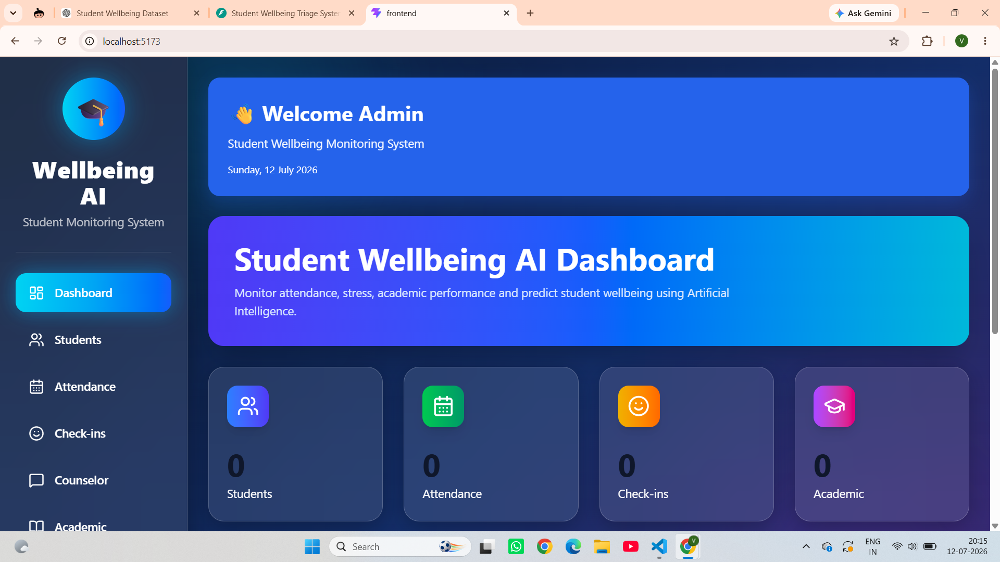
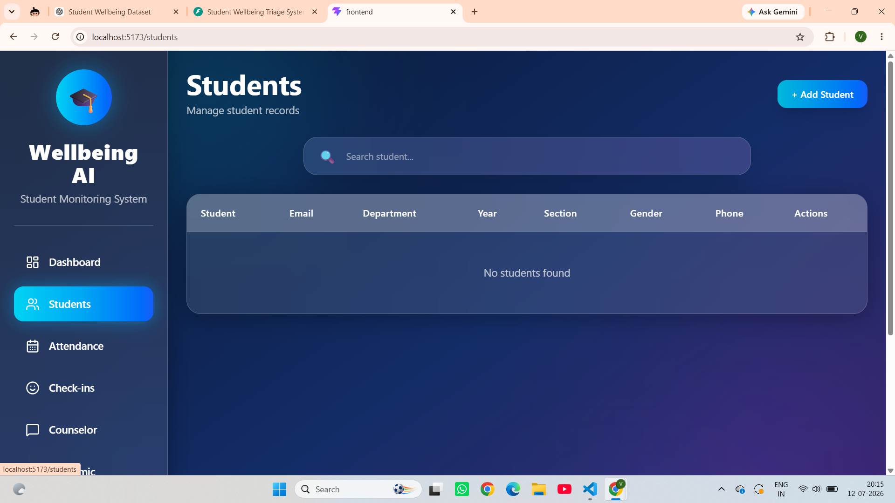
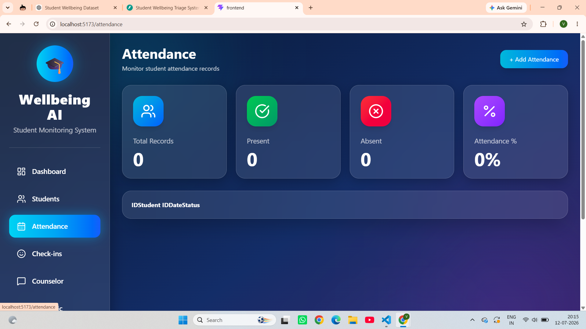
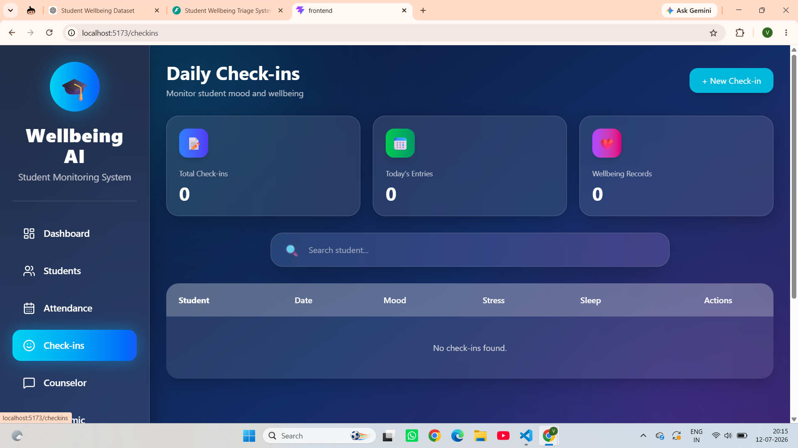
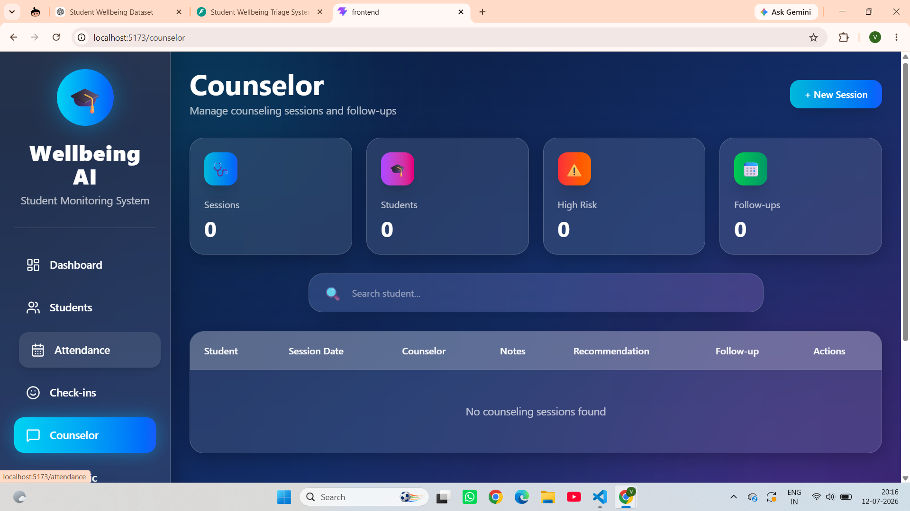
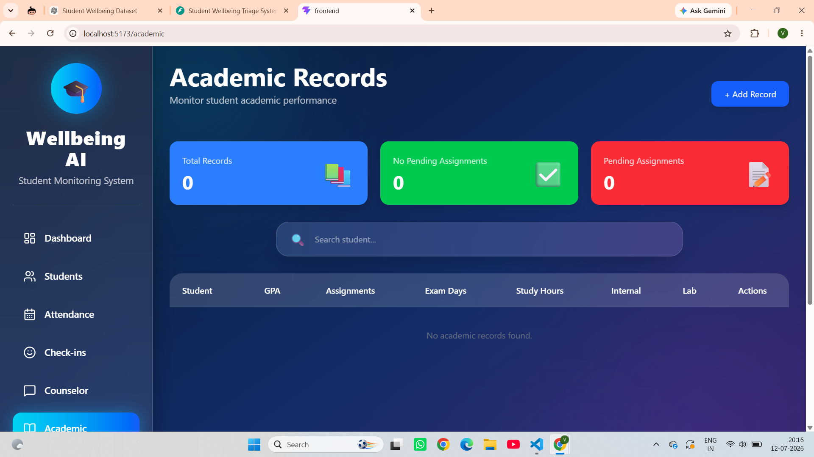
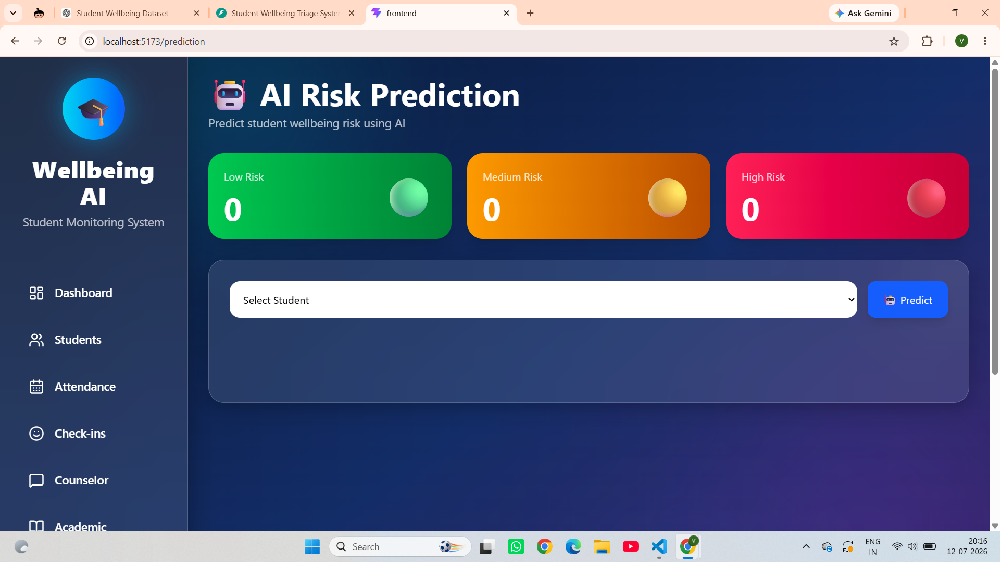
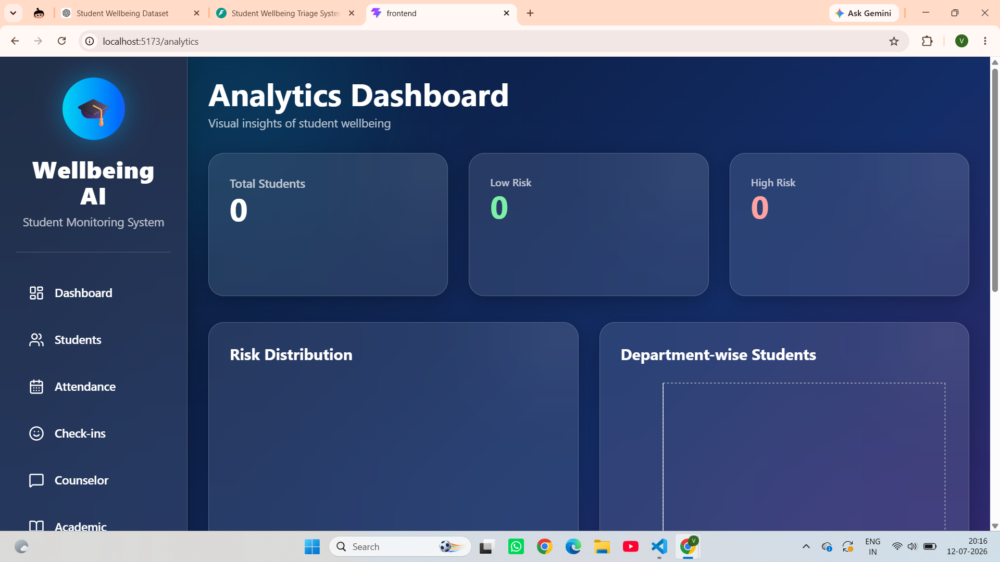

# 🎓 Student Wellbeing Triage System

---

## Features

- Student Management
- Attendance Tracking
- Daily Mood Check-ins
- Counselor Session Management
- Academic Performance Tracking
- AI-Based Risk Prediction
- Analytics Dashboard
- Glassmorphism UI
- Responsive Dashboard

---

## Technology Stack

### Frontend
- React.js
- Vite
- Tailwind CSS
- Recharts
- Axios

### Backend
- FastAPI
- SQLAlchemy
- SQLite
- Scikit-Learn
- Pandas
- NumPy

---

## Modules

- Dashboard
- Students
- Attendance
- Daily Check-ins
- Counselor
- Academic Records
- Prediction
- Analytics

---

## AI Model

Machine Learning model predicts:

- Low Risk
- Medium Risk
- High Risk

using

- Attendance
- Stress Level
- Sleep Hours
- GPA
- Assignments
- Internal Marks
- Lab Performance

---

## Project Structure

```
Student-Wellbeing-Triage-System/

├── frontend/
├── backend/
├── README.md
```

---

## Installation

### Backend

```bash
cd backend
python -m venv venv
venv\Scripts\activate
pip install -r requirements.txt
uvicorn app.main:app --reload
```

### Frontend

```bash
cd frontend
npm install
npm run dev
```

---

## Screenshots

(Add screenshots here)

- Dashboard
- Students
- Attendance
- Check-ins
- Counselor
- Academic
- Prediction
- Analytics

---

## Future Enhancements

- Email Notifications
- Mobile Application
- AI Chatbot
- Role-based Authentication
- Cloud Deployment

---
## Project Screenshots

### Dashboard


### Students


### Attendance


### Daily Check-ins


### Counselor


### Academic


### Prediction


### Analytics


## Author

Vinayak Garaga

B.Tech, RIET
